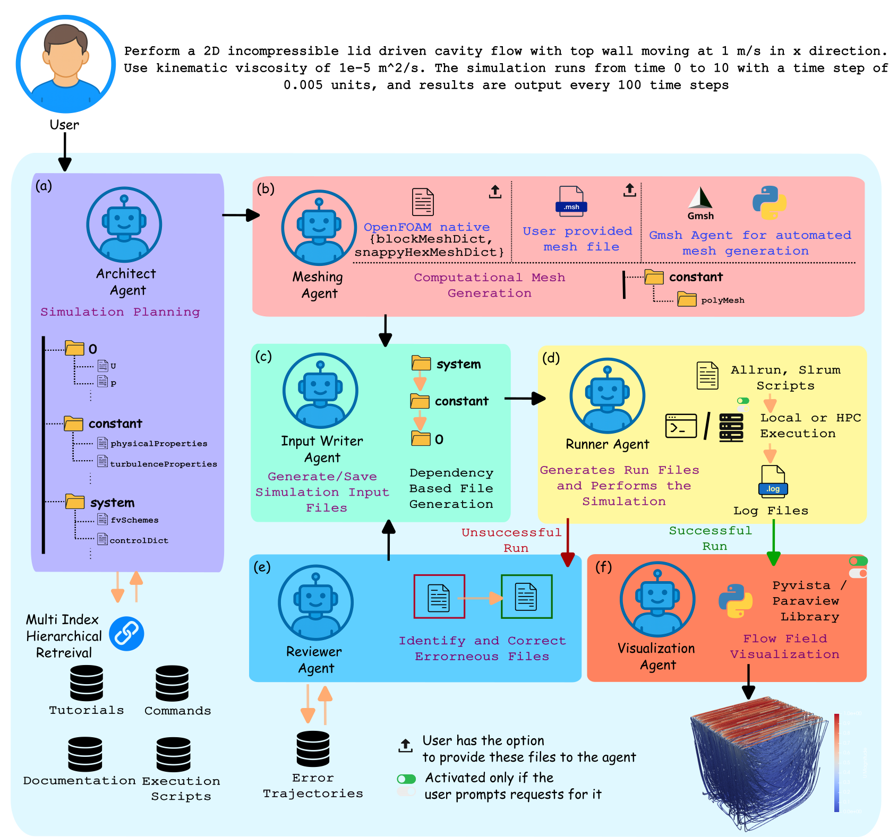

# Foam-Agent

<p align="center">
  
</p>

<p align="center">
    <em>An End-to-End Composable Multi-Agent Framework for Automating CFD Simulation in OpenFOAM</em>
</p>

You can visit https://deepwiki.com/csml-rpi/Foam-Agent for a comprehensive introduction and to ask any questions interactively.

**Foam-Agent** is a multi-agent framework that automates the entire **OpenFOAM**-based CFD simulation workflow from a single natural language prompt. By managing the full pipeline—from meshing and case setup to execution and post-processing—Foam-Agent dramatically lowers the expertise barrier for Computational Fluid Dynamics. Evaluated on [FoamBench](https://arxiv.org/abs/2509.20374) of 110 simulation tasks, our framework achieves an **88.2% success rate**, demonstrating how specialized multi-agent systems can democratize complex scientific computing.

## Key Innovations

Our framework introduces three key innovations:

* **End-to-End Simulation Automation**: Foam-Agent manages the full simulation pipeline, including advanced pre-processing with a versatile Meshing Agent that handles external mesh files and generates new geometries via **Gmsh**, automatic generation of HPC submission scripts, and post-simulation visualization via **ParaView/PyVista**.
* **High-Fidelity Configuration**: We use a Retrieval-Augmented Generation (RAG) system based on a hierarchical index of case metadata. Generation proceeds in a dependency-aware order, ensuring consistency and accuracy across all configuration files.
* **Composable Service Architecture**: The framework exposes its core functions as discrete, callable tools using a Model Context Protocol (MCP). This allows for flexible integration with other agentic systems for more complex or exploratory workflows. Code will be released soon.

## Features
### 🔍 **Enhanced Retrieval System**
- **Hierarchical retrieval** covering case files, directory structures, and dependencies
- **Specialized vector index architecture** for improved information retrieval
- **Context-specific knowledge retrieval** at different simulation stages

### 🤖 **Multi-Agent Workflow Optimization**
- **Architect Agent** interprets requirements and plans file structures
- **Input Writer Agent** generates configuration files with consistency management
- **Runner Agent** executes simulations and captures outputs
- **Reviewer Agent** analyzes errors and proposes corrections

### 🛠️ **Intelligent Error Correction**
- **Error pattern recognition** for common simulation failures
- **Automatic diagnosis and resolution** of configuration issues
- **Iterative refinement process** that progressively improves simulation configurations

### 📐 **External Mesh File Support**
- **Custom mesh integration** with GMSH `.msh` files
- **Boundary condition specification** through natural language requirements
- **Currently supports** GMSH ASCII 2.2 format mesh files
- **Seamless workflow** from mesh import to simulation execution

**Example Usage:**
```bash
python foambench_main.py --openfoam_path $WM_PROJECT_DIR --output ./output --prompt_path ./user_requirement.txt --custom_mesh_path ./tandem_wing.msh
```

**Example Mesh File:** The `geometry.msh` file in this repository is taken from the [tandem wing tutorial](https://github.com/openfoamtutorials/tandem_wing) and demonstrates a 3D tandem wing simulation with NACA 0012 airfoils.

**Requirements Format:** In your `user_req_tandem_wing.txt`, describe the boundary conditions and physical parameters for your custom mesh. The agent will automatically detect the mesh type and generate appropriate OpenFOAM configuration files.

## Getting Started

### 1. Clone the repository and install dependencies

```bash
git clone https://github.com/csml-rpi/Foam-Agent.git
cd Foam-Agent
```
If you prefer an old stable version, do
```bash
git checkout v1.0.0
```
Otherwise, FoamAgent will be at the latest version.

#### Foam-Agent Docker
You can skip the rest of [1](#1-clone-the-repository-and-install-dependencies) and [2](#2-install-and-configure-openfoam-v10) by using a Docker, which has the entire Foam-Agent framework already set up. The instructions are at [docker/README.md](docker/README.md). Afterwards, go to [3](#3-database-preprocessing-first-time-setup).

Otherwise, continue with
```
conda env create -n openfoamAgent -f environment.yml
conda activate openfoamAgent
```

### 2. Install and configure OpenFOAM v10

Foam-Agent requires OpenFOAM v10. Please follow the official installation guide for your operating system:

- Official installation: [https://openfoam.org/version/10/](https://openfoam.org/version/10/)

Verify your installation with:

```bash
echo $WM_PROJECT_DIR
```
and the result should be
```
/opt/openfoam10
```
or something similar.

`WM_PROJECT_DIR` is an environment variable that comes with your OpenFOAM installation, indicating the location of OpenFOAM on your computer.

### 3. Database preprocessing (first-time setup)

Before running any workflow, you must preprocess the OpenFOAM tutorial and command database. This can be done automatically or manually.

#### Recommended: Automatic preprocessing

```bash
python foambench_main.py --openfoam_path $WM_PROJECT_DIR --output ./output --prompt_path ./user_requirement.txt
```

This script will automatically run all necessary preprocessing scripts in `database/script/` and then launch the main workflow.

#### Manual preprocessing (advanced)

If you prefer to run preprocessing scripts manually, execute the following:

```bash
python database/script/tutorial_parser.py --output_dir=./database/raw --wm_project_dir=$WM_PROJECT_DIR
python database/script/faiss_command_help.py --database_path=./database
python database/script/faiss_allrun_scripts.py --database_path=./database
python database/script/faiss_tutorials_structure.py --database_path=./database
python database/script/faiss_tutorials_details.py --database_path=./database
```

### 4. Run a demo workflow

#### Option 1: Automated benchmark (recommended)

```bash
python foambench_main.py --openfoam_path $WM_PROJECT_DIR --output ./output --prompt_path ./user_requirement.txt
```

#### Option 2: Directly run the main agent

```bash
python src/main.py --prompt_path ./user_requirement.txt --output_dir ./output
```

- You can also specify a custom mesh:

```bash
python src/main.py --prompt_path ./user_requirement.txt --output_dir ./output --custom_mesh_path ./my_mesh.msh
```

#### Example user_requirement.txt

```
do a Reynolds-Averaged Simulation (RAS) pitzdaily simulation. Use PIMPLE algorithm. The domain is a 2D millimeter-scale channel geometry. Boundary conditions specify a fixed velocity of 10m/s at the inlet (left), zero gradient pressure at the outlet (right), and no-slip conditions for walls. Use timestep of 0.0001 and output every 0.01. Finaltime is 0.3. use nu value of 1e-5.
```

### 5. Configuration and environment variables

- Default configuration is in `src/config.py`. You can modify model provider, database path, and other parameters there.
- You must set the `OPENAI_API_KEY` environment variable if using OpenAI/Bedrock models.

### 6. Troubleshooting

- **OpenFOAM environment not found**: Ensure you have sourced the OpenFOAM bashrc and restarted your terminal.
- **Database not initialized**: Make sure you have run `foambench_main.py` or all scripts in `database/script/`.
- **Missing dependencies**: After activating the environment, run `pip install -r requirements.txt` if needed.
- **API key errors**: Ensure `OPENAI_API_KEY` is set in your environment.

## Citation
If you use Foam-Agent in your research, please cite our paper:
```bibtex
@article{yue2025foam,
  title={Foam-Agent: Towards Automated Intelligent CFD Workflows},
  author={Yue, Ling and Somasekharan, Nithin and Cao, Yadi and Pan, Shaowu},
  journal={arXiv preprint arXiv:2505.04997},
  year={2025}
}

@article{yue2025foamagent,
  title={Foam-Agent 2.0: An End-to-End Composable Multi-Agent Framework for Automating CFD Simulation in OpenFOAM},
  author={Yue, Ling and Somasekharan, Nithin and Zhang, Tingwen and Cao, Yadi and Pan, Shaowu},
  journal={arXiv preprint arXiv:2509.18178},
  year={2025}
}

@article{somasekharan2025cfdllmbench,
  title={CFD-LLMBench: A Benchmark Suite for Evaluating Large Language Models in Computational Fluid Dynamics},
  author={Nithin Somasekharan, Ling Yue, Yadi Cao, Weichao Li, Patrick Emami, Pochinapeddi Sai Bhargav, Anurag Acharya, Xingyu Xie, Shaowu Pan},
  journal={arXiv preprint arXiv:2509.20374},
  year={2025}
}

```
